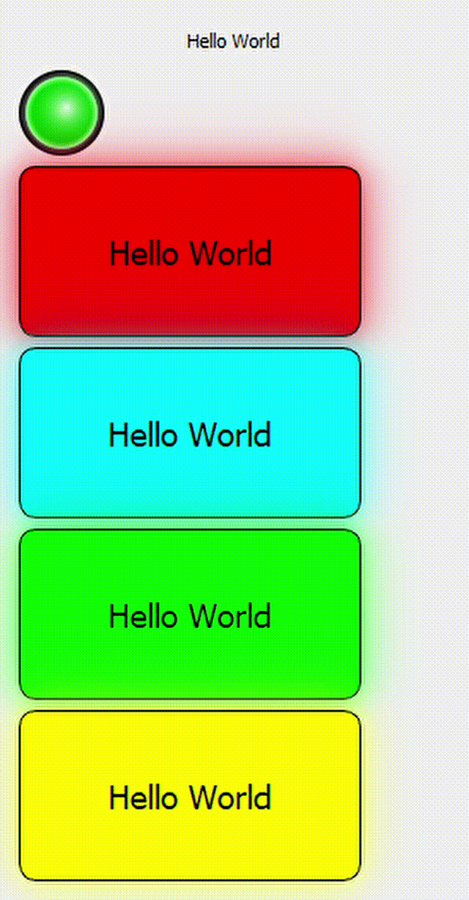

# QtExtraWidgets  ?style=flat&logo=appveyor" alt="Awesome Badge"/> 

This is a collection of extra widgets for Qt. It is a work in progress.

Requirements
------------
* Qt 5.2 or later
* CMake 2.8.11 or later
* C++11 compiler
* Qt5Widgets

# List of widgets
* ## 1- QLedIndicator
    Simple LED indicator widget. 

* ## 2- QPanelIndicator  
    Simple panel indicator widget.

# ScreenShots:

# Contact:
* Email: [mail@hakankaya.kim]
* Twitter: [@mohamed_ayman](https://twitter.com/haknkayaa)
